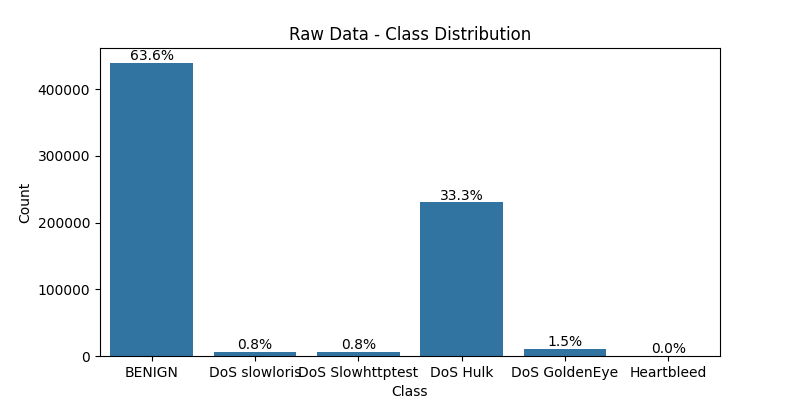
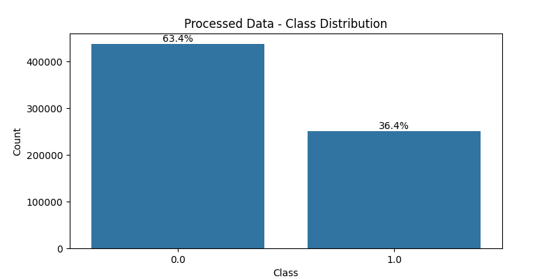
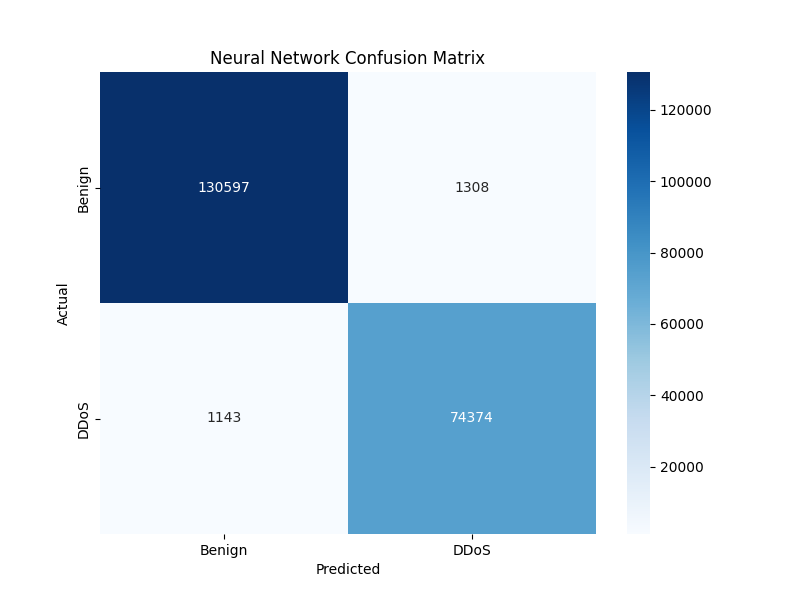
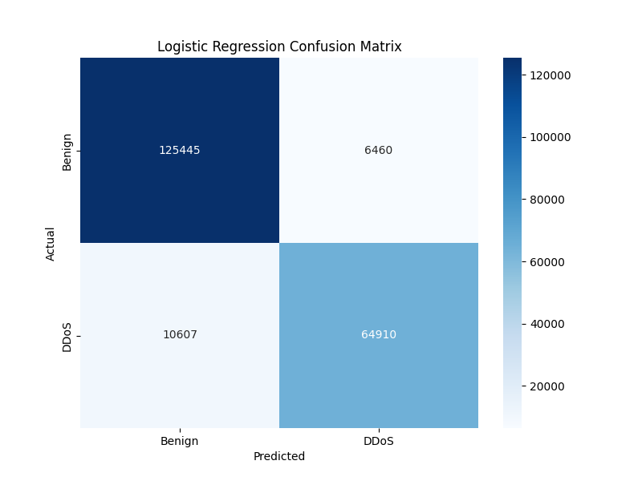
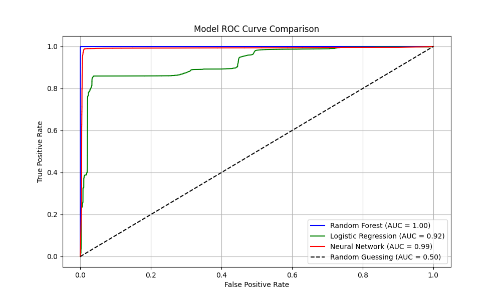

# 💻 Machine Learning Based Detection and Prevention of DDoS Attacks for Cyber Defence

> A robust and modular machine learning pipeline to detect Distributed Denial-of-Service (DDoS) attacks using real-world CICIDS 2017 network traffic data. This project focuses on accurate classification of malicious traffic patterns and presents a complete experimental analysis using Python and LaTeX.

---

## 🧠 Project Overview

DDoS attacks pose one of the most severe threats to modern digital infrastructure. This project proposes a system using machine learning to classify traffic as either benign or malicious. It includes:

- Data preprocessing and label transformation
- Feature analysis and selection
- Model training using multiple classifiers
- Evaluation using standard ML metrics
- Confusion matrix & ROC curve visualization
- Full academic report (IEEE format)

---

## 📂 Dataset Access

📁 Dataset used: `Wednesday-workingHours.pcap_ISCX.csv` from CICIDS 2017  
Due to GitHub's file size limits, it’s hosted on Google Drive:

🔗 **[Download Dataset](https://drive.google.com/drive/folders/1tEYe5cuwDwEIiMhxnKu4lncZ-HKOVJ1e?usp=sharing)**

👉 Place the downloaded `.csv` file inside a `Data/` folder in this repo.

---

## ⚙️ Technologies Used

- Python 🐍
- Scikit-learn
- Pandas, NumPy
- Matplotlib, Seaborn
- Git & GitHub
- LaTeX (IEEE format)


---

## 🛠️ How to Run

1. Clone this repository:
    ```bash
    git clone https://github.com/Arup-gope/Machine_Learning_Based_Detection_and_Prevention_of_DDoS_Attacks_for_Cyber_Defence.git
    cd Machine_Learning_Based_Detection_and_Prevention_of_DDoS_Attacks_for_Cyber_Defence
    ```

2. Install required dependencies:
    ```bash
    pip install -r requirements.txt
    ```

3. Run the project:
    ```bash
    python project.py
    ```
---
## 📸 Screenshots

**Raw Dataset Distribution**  


**Processed Dataset Distribution**  


**Random Forest Confusion Matrix**  


**Neural Network Confusion Matrix**  


**Logistic Regression Confusion Matrix**  


**ROC Curve Comparison**  



---

## 🧪 Classifiers Implementation Result

| Model               | Accuracy | Precision | Recall | F1-Score |
|--------------------|----------|-----------|--------|----------|
| Random Forest       | 99.95%   | 99.89%    | 99.97% | 99.93%   |
| Neural Network (MLP)| 98.82%   | 98.27%    | 98.49% | 98.38%   |
| Logistic Regression | 91.77%   | 90.95%    | 85.95% | 88.38%   |
---


The academic paper is available in:
- `main.tex` (LaTeX format)
- `Machine_Learning_Based_Detection_and_Prevention_of_DDoS_Attacks_for_Cyber_Defence.pdf` (compiled)

It includes:
- Literature review
- Dataset analysis
- Model performance
- Visuals (Confusion Matrix, ROC)
- Conclusion and future work

---

#### DataSet Reference:
```bibtex
@inproceedings{sharafaldin2018toward,
  title={Toward generating a new intrusion detection dataset and intrusion traffic characterization},
  author={Sharafaldin, Iman and Lashkari, Arash Habibi and Ghorbani, Ali A.},
  booktitle={Proceedings of the 4th International Conference on Information Systems Security and Privacy (ICISSP)},
  pages={108--116},
  year={2018}
}
```


